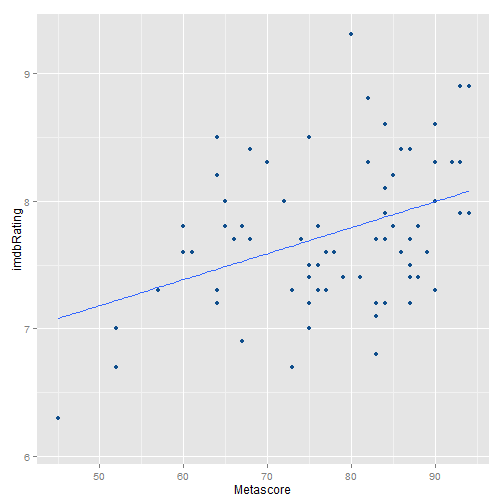

## Introduction


- Every year, [Academy Awards]("https://en.wikipedia.org/wiki/Academy_Awards") are given to the best movies featured in the previous year.
- The `Oscar shiny app` explores data from the movies that were nominated in the Oscar ceremonies.  
- The app can assessed on the [shinyapps.io]("https://jbeaulieu.shinyapps.io/oscar")
- Alternatively, the app can be run locally by:
  1. downloading the `server.R` and `ui.R` files from the [github]("https://github.com/julienfbeaulieu/oscar-project""), 
  2. setting the working directory to where the files are located,
  3. running the following R code:


```r
library(shiny)
runApp()
```


---

## Methodology
1. The [original dataset]("https://www.aggdata.com/free_data_awards_locations/academy_awards") lists information about each nomination for each year. 
    - Since an award can either go to a film or to an artist, I processed the database to distinguish the two. The resulting `oscar.csv` database lists 10 variables about 10098 nominations.
    
2. From this, a second dataset was created and takes the point of view of each film. Number of academy nominations and awards were summed, and extra information was pulled out using the [omdb api]("http://www.omdbapi.com/"). The resulting `movie.csv` database lists 27 variables about 4361 nominated movies.
    - For instance, the following call retrieves information about the [titanic]("https://en.wikipedia.org/wiki/Titanic_(1997_film)") movie:
 

```r
  t <- "Titanic"
  y <- "1997"
  url <- paste0("http://www.omdbapi.com/?t=",t,"&y=",y,"&plot=short&r=json")
  
  temp <- as.data.frame(fromJSON(url))
```

---


## Side panel

### Filter movies
In the side panel, you can filter the dataset, either by year, by number of oscar nominations or awards.
    - For instance, the data can be filtered for the period 1980-2000, with a minimum number of 5 nominations and 0 awards.
    - The movie database is the filtered using the following r code:
    

```r
    minYear <- 1980; maxYear <- 2000; minNomination <- 5; minAward <- 0
    movieSubset <- filter(movie, Year >= minYear, Year <= maxYear, 
                          Academy.Nominations >= minNomination, Academy.Awards >= minAward)
```
    
### Select variables
Additionnaly, you can select variables for the x- and y-axis of the graph and the for the linear model.
    - For instance, the [metascore]("https://en.wikipedia.org/wiki/Metacritic#Metascores") and the [imdb user rating]("https://en.wikipedia.org/wiki/Internet_Movie_Database") could be selected as the x and y variables.


```r
    plotData <- data.frame(y = movieSubset[["imdbRating"]], x = movieSubset[["Metascore"]])
```

---

## Output graph
For the preceeding filtered subset of movies and the variables selected, the Oscar shiny app would output the following graph:

 

---

## Output linear model

- For the same filter and variable setting, the Oscar shiny app would ouput this linear model:


```
## 
## Call:
## lm(formula = as.formula(paste("imdbRating", " ~ ", "Metascore")), 
##     data = movieSubset)
## 
## Residuals:
##      Min       1Q   Median       3Q      Max 
## -1.05376 -0.39359 -0.09442  0.34108  1.50724 
## 
## Coefficients:
##             Estimate Std. Error t value Pr(>|t|)    
## (Intercept) 6.166080   0.432039  14.272  < 2e-16 ***
## Metascore   0.020333   0.005502   3.696 0.000421 ***
## ---
## Signif. codes:  0 '***' 0.001 '**' 0.01 '*' 0.05 '.' 0.1 ' ' 1
## 
## Residual standard error: 0.5305 on 73 degrees of freedom
##   (46 observations deleted due to missingness)
## Multiple R-squared:  0.1576,	Adjusted R-squared:  0.1461 
## F-statistic: 13.66 on 1 and 73 DF,  p-value: 0.000421
```

- Namely, for the highly nominated movies (>= 5 nominations) of the period 1980-2000, the Metascore is highly significant in predicting the imdbRating. Though, the correlation between the two variables is really low.


